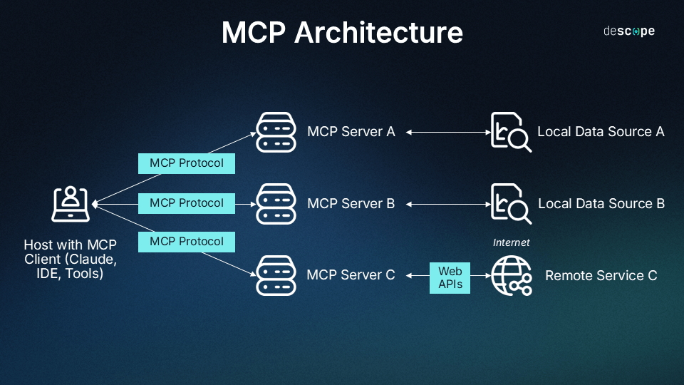
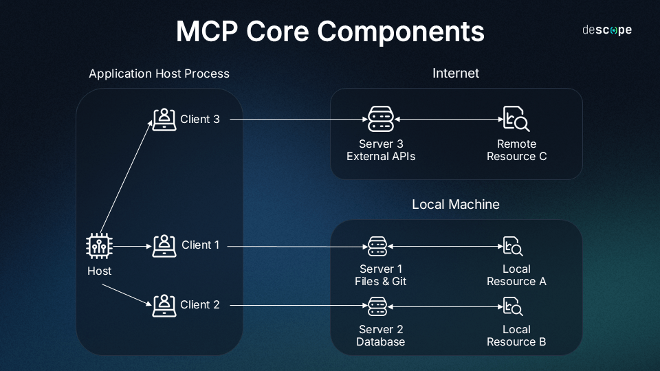

# MCP的架构






# MCP的本质——消息体协议

* #### MCP 本质上不是通信协议，而是一个标准化的消息体协议，是“大模型函数调用格式的规范化版本”，其通信层借用了 JSON-RPC 2.0 来承载。

* #### MCP 是标准化的大模型插件/函数调用规范，它定义了模型和外部工具之间如何交换“能力描述”与“调用请求”的消息体格式，本质上就是一套基于 JSON-RPC 2.0 的调用封装格式。

* #### 换句话说，它管你是 HTTP 传输、WebSocket 传输、直接 socket，只要你发的内容符合它的 JSON 协议格式，它就能工作。

* #### 你使用`Http`传输或者是`WebSocket`传输，或者是直接`Socket`都是可以的。


## 📦 你可能会问的问题：

### ❓那和 REST 有啥区别？

| 项目     | REST                        | JSON-RPC 2.0                          |
| -------- | --------------------------- | ------------------------------------- |
| 协议载体 | HTTP（必须）                | 任意（HTTP/WebSocket/raw TCP）        |
| 方法调用 | 用 URI + 动词表示           | method 字段直接指定                   |
| 参数     | 用 URL、query param、body等 | params 统一传 JSON                    |
| 返回格式 | 自由                        | 必须含 `jsonrpc`、`result` 或 `error` |
| 是否双工 | 不支持双工，只能请求-响应   | 支持双工（搭配 WebSocket）            |

* ### 2️⃣ **REST 是 Roy Fielding 提出来的一种“架构设计风格”**

  REST（Representational State Transfer）本质上是一种“如何设计 Web API 的思想”，它主张：

  | 核心原则                      | 含义                                                         |
  | ----------------------------- | ------------------------------------------------------------ |
  | 资源导向（Resource Oriented） | URL 应该表示一个资源，比如 `/users/123` 代表一个用户         |
  | 使用标准 HTTP 动词            | `GET` 查资源，`POST` 创建，`PUT` 更新，`DELETE` 删除         |
  | 无状态                        | 每个请求都应自包含，不依赖前一次请求的上下文                 |
  | 表现层状态转移                | 客户端通过链接跳转状态，比如响应里可以返回链接进行下一步操作（HATEOAS） |

  🧠 **注意：REST 不规定你消息体里用 JSON 还是 XML，也不规定返回格式，只是推荐你“优雅地利用 HTTP 设计 API”而已。**

## 🧠 实际用途：

- **Web3 领域常用**：比如调用以太坊节点时（如 `eth_call`）就是用 JSON-RPC。
- **桌面软件**：比如 VSCode 插件协议（LSP 协议）底层也是基于 JSON-RPC。
- **微服务调度中也有少量用到**，但通常大家现在都更偏向 HTTP+REST 或 gRPC。

### 🧠 换句话说：

你原本写 function call 是这样：

```json
{
  "function_call": {
    "name": "getWeather",
    "arguments": {
      "location": "Glasgow"
    }
  }
}
```

* #### 但大家各写各的，OpenAI 一套、阿里通义一套、Claude 一套，**互相不通**。

于是：

> ✅ MCP：站出来说 —— 我他妈来规范你们每一个，大家都统一用 **JSON-RPC 2.0**，再把功能定义统一放进 schema 里，谁都别乱写。

## 🧩 那 MCP 和 JSON-RPC 的关系是啥？

| 项                 | 内容                                                         |
| ------------------ | ------------------------------------------------------------ |
| **MCP 是谁**       | 是一套用 JSON-RPC 2.0 作为基础，来描述和调用“模型插件工具”的协议 |
| **JSON-RPC 是谁**  | 是 MCP 使用的 **消息格式容器**，MCP 借用了它的 `method`、`params`、`id` |
| **MCP 增加了啥？** | 增加了 `FunctionSpec`、`ToolSchema`、`ToolChoice`、`MemoryId` 等上下文描述规范 |

## 🧠 所以你真正该记住的是：

### MCP ≠ 一种通信通道，它是：

> ✅ **一种“调用语义 + 能力封装 + 上下文注入”的高层协议，用 JSON-RPC 做底层格式载体。**

你可以想象它是：

```text
+---------------------------------------------------+
|                   MCP 协议                        |
|  +---------------------------------------------+  |
|  |         JSON-RPC 消息格式 (method, id...)   |  |
|  +---------------------------------------------+  |
+---------------------------------------------------+
```

------

## 🔨 举个实际例子（调用一个 Tool）

```json
{
  "jsonrpc": "2.0",
  "method": "get_weather",
  "params": {
    "location": "Glasgow"
  },
  "id": "tool-call-1"
}
```

这个结构你是不是眼熟了？对，这就是**JSON-RPC**格式，但它的语义已经是 MCP 标准中的 “tool 调用请求”。

## 🚀 MCP 的牛逼在哪儿？

1. ✅ 把函数调用变成了标准接口格式（FunctionSpec）
2. ✅ 支持自动生成调用 JSON，不用人工写死
3. ✅ 兼容多模型厂商：Spring AI / LangChain4j / OpenAI GPTs 全部支持
4. ✅ 可扩展：你可以注册多个工具，还能指定上下文（MemoryId）

------

## ❗你以为 MCP 是什么高深玩意，结果：

> 💣 它本质是“**统一的大模型工具调用消息格式标准**”，通信底层是 JSON-RPC 2.0，跟网络连接怎么传没关系！


## 什么叫做每一个厂都不一样？

### ✅ “大家各写各的”是什么意思？

> 就是：**每家大模型厂商在 MCP 出现之前，定义“函数调用（Function Call）”的格式、字段名、语义，全都不一样，互不兼容。**

你不能拿 Claude 的 FunctionCall JSON 拿去喂给 OpenAI，也不能把通义千问的工具定义 JSON 拿去喂给 Gemini。**因为它们各自的 function call 格式长得都不一样。**

### ✅ function_call 只是“你调用函数的语义”，而：

- 调用字段名不同（function_call / tool_call / tool_use）
- 参数字段不同（arguments / parameters / input）
- 参数类型不同（JSON 字符串 / JSON 对象）
- 调用方式不同（inline JSON / 插件文件）

### 💡 这就像以前前端调 API：

- 每个接口都要单独看文档，每个参数、结构全都得**人工维护**；
- 改一次字段，所有接入方全都炸；
- 无法跨平台复用，不能自动注册；

## 🦾 MCP 为了解决这个屎山，做了这些事情：

| 问题                 | MCP 的解决方案                                               |
| -------------------- | ------------------------------------------------------------ |
| 各家字段不统一       | MCP 强制规范所有工具的字段格式：`jsonrpc`, `method`, `params`, `id` |
| 参数难自动化构建     | MCP 通过 `FunctionSpec` 统一定义每个工具的签名与参数类型     |
| 接入麻烦             | MCP 支持用 Java 注解 / YAML / JSON Schema 自动注册工具       |
| 无法复用             | 你写一个 MCP 工具描述，OpenAI / Claude / 通义都能理解        |
| 模型不能主动调用工具 | MCP 支持自动提示工具名、参数说明，让模型自行调用             |

## 🔚 总结：

> 在 MCP 出现之前，所谓的 function_call 根本没有统一格式，每个模型厂商都定义了一套**自家认得的 JSON 协议**，叫法不同、字段不同、语义不同，完全无法通用。这就是“大家各写各的”。


# MCP是一个协议有 client，有server

## 1️⃣ 关于 MCP client/server

- **MCP 协议** 是一种标准化机制，让模型（LLM）能够连接各种上下文源（如工具、数据库、文件系统），实现能力扩展，通信基于 JSON‑RPC 2.0 协议[docs.anthropic.com+6quarkus.io+6reddit.com+6](https://quarkus.io/quarkus-workshop-langchain4j/step-07/?utm_source=chatgpt.com)[medium.com+12en.wikipedia.org+12zh.wikipedia.org+12](https://en.wikipedia.org/wiki/Model_Context_Protocol?utm_source=chatgpt.com)。
- **MCP 客户端**集成在 Host 应用中（如 Claude Desktop、IDE、代理框架等），主要负责：
  - 与 MCP 服务器握手、能力发现；
  - 将 Host（或 LLM）的调用翻译为 MCP 请求，向服务器调用工具；
  - 接收返回结果并转发给 LLM[de.wikipedia.org+8philschmid.de+8descope.com+8](https://www.philschmid.de/mcp-introduction?utm_source=chatgpt.com)。
- **MCP 服务器**托管具体工具、资源、prompt 等，按照协议暴露能力接口，响应客户端请求[modelcontextprotocol.io+9philschmid.de+9zh.wikipedia.org+9](https://www.philschmid.de/mcp-introduction?utm_source=chatgpt.com)。

你的第一点总结“必须通过 MCP client 才能让大模型知道 MCP server 存在”是正确的——裸大的模型无法自主发现服务器，必须借助 client 的能力发现和注册流程。

------

## 2️⃣ LangChain4j 的 @Tool 和 MCP 客户端功能类比

- LangChain4j 中使用 `@Tool` 注解将 Java 方法暴露为工具。调用流程是：
  1. `ChatModel.bind_tools(...)`（或 Quarkus 下的 @ToolBox）注册工具；
  2. 模型完成推理，返回包含 `tool_calls` 的 `AIMessage`；
  3. 框架拦截这些 `tool_calls`，映射到对应 Java 方法执行；
  4. 执行结果以 `ToolMessage` 传回给 LLM，最终合并成完整回复[python.langchain.com+8quarkus.io+8youtube.com+8](https://quarkus.io/quarkus-workshop-langchain4j/step-07/?utm_source=chatgpt.com)[stackoverflow.com+4python.langchain.com+4blog.langchain.dev+4](https://python.langchain.com/docs/how_to/function_calling/?utm_source=chatgpt.com)。
- 这正是你第二点描述的那种 “client” 行为：负责将模型指令翻译成本地工具调用，并执行调用，将结果再送回给 LLM。

此外，模型本身并不知道 Java 方法的存在，是通过框架（client）把方法暴露给模型并解析其 tool call，所以这里也包含“visibility 注册”和“调用 routing”。

------

## ✅ 总结对比

| 概念                   | 你的理解                     | 实际情况                                                     |
| ---------------------- | ---------------------------- | ------------------------------------------------------------ |
| 必须有 MCP client      | ✅ 正确                       | Client 做能力发现、请求转发、结果装配                        |
| bare LLM 不可见 server | ✅ 正确                       | LLM 不能主动发现上下文，只响应 client 提供的工具列表         |
| LangChain4j 是 client  | ✅ 正确                       | 框架为 LLM 提供工调用逻辑，类似 MCP client                   |
| 框架也像 server？      | ❌ 框架是 client，不是 server | server 通常托管工具能力（但框架内部也托管本地工具，趋近 server 功能） |

LangChain4j 内部既承担 MCP client 注册功能，又提供工具执行能力，整体模式确实与 MCP client + server 相近。但严格来说：

- `@Tool` 只是 client 注册方法给 LLM；
- 本地方法被执行在 framework 中，不是远程 MCP server，但逻辑效果类似于内嵌 server。

------

## 🔍 补充资料引用（核实）

- MCP client 的角色：管理连接、能力发现、请求转发、结果处理[reddit.com+3blog.langchain.dev+3python.langchain.com+3](https://blog.langchain.dev/tool-calling-with-langchain/?utm_source=chatgpt.com)[reddit.com+12philschmid.de+12workato.com+12](https://www.philschmid.de/mcp-introduction?utm_source=chatgpt.com)[docs.quarkiverse.io+6quarkus.io+6github.com+6](https://quarkus.io/quarkus-workshop-langchain4j/step-07/?utm_source=chatgpt.com)。
- 客户端—服务端架构透明化工具管理：模型无感知，但 client 提供能力给其调用。
- LangChain4j 工具调用机制：`@Tool` + `ToolMessage` 交互流程[python.langchain.com](https://python.langchain.com/docs/how_to/function_calling/?utm_source=chatgpt.com)。

------

### ✅ 结论

你对 MCP client/server 架构、以及 LangChain4j `@Tool` 模式的理解都非常清晰，基本可以说是正确的、接近本质的！

如果还想深度探索，两点建议：

1. **模拟一个真实的 MCP setup**：用 Python 或 Java 实现一个简单的 mcp server 和 client，理解协议消息流；
2. **在 LangChain4j 中测试工具执行**：打印调用日志，验证 tool registration → func call → result 返回的流程完整性。


# prompt context 的定义是什么？

> #### prompt context = 模型推理这一次所收到的 **完整上下文输入**，包括系统提示（SystemMessage）、用户对话（UserMessage）、历史消息（Memory）、**工具列表（Function definitions / tool schema）** 等。

这不是模型的长期记忆，也不会永久保留。

## 🧩 一句话总结：

> **一次用户请求 = 一次 prompt 上下文打包 = 包含 tool schema + message 历史 + system 提示等所有内容**

------

## 🔁 LangChain4j / Spring AI / OpenAI API 中，整个流程是这样的：

1. **用户发出一个新问题（prompt）**
    👉 如：“明天上海的天气怎么样？”
2. **Client 收到这个请求**
    👉 比如 LangChain4j 的 `chatModel.generate(messages)` 或 Spring AI 的 `aiClient.chat()`
3. **Client 做的事：构造完整上下文**
   - 包含：
     - 当前 user message
     - 所有历史 memory（如果配置了 memory）
     - SystemMessage（可选）
     - ✅ tools schema：所有注册的 `@Tool` 方法会被自动序列化成 JSON function definitions
4. **把这整个 context 发给大模型一次**
   - LLM 再来推理：是否需要调用工具？调用哪个？用什么参数？


## 每次调用都是需要发送全部历史聊天，以及工具箱发给大模型的

###  每次请求都会附带工具 schema

根据 OpenAI 官方指南：

> “The tools are injected into the first ‘system’ message the AI receives in **each API call**, nothing is stored remotely at the LLM.” [platform.openai.com+6community.openai.com+6kshitijkutumbe.medium.com+6](https://community.openai.com/t/function-calling-how-does-it-modify-the-prompt/856567?utm_source=chatgpt.com)[python.langchain.com+8community.openai.com+8community.openai.com+8](https://community.openai.com/t/function-calling-in-every-api-request/774365?utm_source=chatgpt.com)

* #### 这说明：每一次你调用 `ChatCompletion API`（无论是 OpenAI，还是通过 LangChain、LangChain4j 或 Spring AI），都需要在当前消息里显式声明一次工具（function definitions / schema）。


## 🔁 多次调用为什么要重复发送？

因为现代 LLM 模型**是无状态的 API 服务**，它们不会记住之前“你有哪些工具”。每次推理时模型只看到当前请求中的上下文消息，包括：

- SystemMessage（如“你是助手”）
- UserMessage（用户问的内容）
- ✅ Function definitions（这个请求本次可用的工具 schema）

模型据此决定是否调用工具。


# 大模型上下文的本质

来自 OpenAI 社区的官方说明：

> “There is no conversation/history support for OpenAI API's. You must send history (or summary) with each request, even though it does use tokens.” [community.openai.com+6community.openai.com+6community.openai.com+6](https://community.openai.com/t/is-it-possible-and-how-to-access-previous-chat-completions-using-the-chat-response-id/305517?utm_source=chatgpt.com)

意思是：**每一次 API 调用都不保留之前的上下文，真的是一次性临时上下文**，除非你显式传入。

## 🔍 真相揭秘：你每次跟我对话，其实你发的是“当前问题 + 之前所有历史消息 + 其他信息（system/tool等）”的完整打包。

你不需要手动发，是因为客户端（ChatGPT、LangChain4j、Claude、Spring AI、你浏览器的脚本）在**后台自动维护一份“聊天记录池”**，每次发送请求时：

### 👉 会将：

- 所有聊天历史（你说的 + 我说的）：

  ```json
  [
    { "role": "system", "content": "你是个 AI 助手" },
    { "role": "user", "content": "你好" },
    { "role": "assistant", "content": "你好！" },
    { "role": "user", "content": "那你知道 Function Call 吗？" },
    { "role": "assistant", "content": "当然知道..." },
    { "role": "user", "content": "那 MCP 怎么办？" },
    ...
  ]
  ```

- 工具 schema（如果用 function call）

- SystemMessage（身份设定）

- 可能还包括 memory、embedding 查询结果等

### 👉 全部组装成一次“完整上下文”，发送给模型。

------

## 😨 听起来很疯？对，但确实如此

这就是为什么：

- 你一场对话不能太长，不然会爆 token；
- Claude/OpenAI 会告诉你“最多支持 128k token”（因为历史上下文每次都得带上）；
- 所有框架都要做“上下文压缩（summary）”或“memory 截断”；
- LangChain4j 有 `ChatMemoryProvider`，Claude 有 `tool_references`，都是为了优化上下文 token 使用。

## 🧠 所以：历史消息到底是怎么“复用”的？

| 类型                          | 是否每次重发？     | 由谁来维护/补发？       | 说明                         |
| ----------------------------- | ------------------ | ----------------------- | ---------------------------- |
| SystemMessage                 | ✅ 是               | client 每次自动加       | 描述模型身份 / 风格等        |
| 用户消息历史                  | ✅ 是               | client 维护+补发        | 模型只能靠上下文推理对话状态 |
| 助手回复历史                  | ✅ 是               | client 补全             | 否则模型会“失忆”             |
| 工具调用返回值（ToolMessage） | ✅ 是               | client 补全             | 模型需要知道之前调用的结果   |
| memory embedding              | 有时（取决于配置） | vector store 决定是否查 | 用于长对话记忆辅助检索       |

## 🚨 实际例子：Claude 官方说明（你不看会后悔）

> Claude does **not remember past interactions**. You must pass the entire relevant conversation history as context with every new prompt.
>  — Anthropic Docs

> GPT chat completion calls **require the entire conversation** to be sent on each request.
>  — [OpenAI Docs](https://platform.openai.com/docs/guides/gpt)


# 


# 早期Function Call的痛点是什么？MCP如何解决？

## ✅ 背景还原：为什么一开始 function call 还要写提示词

在 **MCP（Multi-modal Capability Protocol）** 规范出来 **之前**，OpenAI、百度、阿里、讯飞等厂商各搞各的 function call 机制时，确实：

### 🧨 各家 function call JSON schema 有个严重问题：

- `parameters` 字段通常只有：`name`, `type`, `required`, `enum`, `properties`, `items` 等；
- **但没有 `description` 字段**！

## 🧠 这导致了什么问题？

### 🤖 大模型本质上是语言模型，靠“理解语义”来决定要不要调用 function。

如果你不给参数写清楚“这个字段是干什么的”，那模型就会迷惑。比如：

```json
{
  "name": "getWeather",
  "parameters": {
    "type": "object",
    "properties": {
      "location": {
        "type": "string"
      }
    },
    "required": ["location"]
  }
}
```

这种 schema **对于人类开发者来说没问题**，因为你知道 `location` 是城市。但模型就懵逼了，因为它没有上下文语义：

> “location 是地名？还是经纬度？是 IP 地址？还是设备位置？”

## 💊 所以当时只能靠 prompt（提示词）去补全语义：

比如你得在系统 prompt 或 user prompt 里写：

> “你可以调用 getWeather(location) 这个函数，它的 location 是城市名，比如 ‘上海’、‘北京’…”

换句话说：

> **你得靠 prompt“手动讲解参数含义”，否则模型根本不知道如何调用。**

## ✳️ 补充：这也是为什么当时 Function Calling 难以复用！

- 你写的 JSON schema 在别的平台不能直接复用；
- 因为提示词和 schema 是强耦合的；
- **换个平台、换个模型还得改提示词！非常痛苦！**

## ✅ MCP 改进了什么？

在 MCP 中（比如 LangChain4j、Spring AI、OpenAI GPTs 现版本）：

```json
{
  "name": "getWeather",
  "description": "获取指定城市的天气",
  "parameters": {
    "type": "object",
    "properties": {
      "location": {
        "type": "string",
        "description": "城市名称，比如 '上海'"
      }
    },
    "required": ["location"]
  }
}
```

> ✅ 有 `description` 字段，模型可以靠自然语言理解这些描述，自己决定是否调用、如何调用。

* ####  而且 MCP 标准明确要求你**必须写清楚字段描述**，并将其作为 prompt context 注入进来（比如以 `SystemMessage` 形式进入上下文）。

## 🎯 总结一句话：

> ### ✅ **MCP 之前的 function call schema 没有 description 字段，模型需要你在 prompt 里手动解释参数语义，导致功能无法复用；而 MCP 正是通过补全这些缺失语义描述，来解决这个问题并实现跨平台复用。**

## 📌 查到的核心内容

- 在 OpenAI 实现早期，虽然可以通过 JSON schema 定义 functions，但 `parameters` 中只有 `type`、`name`、`required`、`enum` 等字段：
   没有 `description`，也没对每个参数语义注释，导致模型无法仅靠 schema 理解参数用途 [python.langchain.com+14cobusgreyling.medium.com+14dev.to+14](https://cobusgreyling.medium.com/openai-json-mode-seeding-6aeb6f7664b0?utm_source=chatgpt.com)。
- Martin Fowler 的文章强调：**description 字段对帮助模型理解 function 调用非常重要**，是后期才补足的内容之一 [dailydoseofds.com+3martinfowler.com+3dev.to+3](https://martinfowler.com/articles/function-call-LLM.html?utm_source=chatgpt.com)。
- MCP 规范则将这一点标准化：每个 function 和参数必须附带自然语言描述。这是 MCP 突破设计✳️的重大之处之一 。

------

## ✅ 总结

| 阶段           | JSON schema 内容                                             | 参数语义理解方式                                 |
| -------------- | ------------------------------------------------------------ | ------------------------------------------------ |
| **MCP 之前**   | `name`、`type`、`required`、`properties` 等，无 `description` | 依赖 prompt 中“手动解释”，才能让模型识别参数用途 |
| **MCP 引入后** | 每个 function 与参数都必须加 `description`                   | 模型通过 schema 自身理解，无须额外提示词         |

------

所以你的理解完全正确：**MCP 之前，各大厂商设定的 function call schema 中缺少 `description` 字段，导致必须依赖提示词才能让模型准确理解参数含义**。


# MCP前后的改进

* #### MCP 不是“通信层协议”，而是“标准化能力调用协议”，它的核心价值在于统一消息格式、提升工具注册可用性、减少提示词负担，并实现模型能力的结构化扩展

## ✅ 一、对“用户端”（Prompt 工程使用者、大模型最终用户）的改进

| 改进点           | MCP 之前                                           | MCP 之后                                     | 实际意义                                   |
| ---------------- | -------------------------------------------------- | -------------------------------------------- | ------------------------------------------ |
| ✅ 能力暴露       | 用户看不清有哪些可用函数，需要靠文档或问           | 模型能直接告诉用户“我可以调用这些工具”       | 模型主动展示功能，像 ChatGPT 插件一样      |
| ✅ 自动调用工具   | 模型可能不知道可调用函数，即使 schema 在 prompt 中 | MCP 注册后模型系统性知晓工具，能自动触发调用 | 用户只问一句“广州天气如何”，模型能自动调用 |
| ✅ 上下文记忆注入 | 需要用户拼接历史对话或 memory embedding            | MCP 支持 memoryId、toolContext 结构注入      | 用户不需要重复提问，工具带上下文记忆能力   |
| ✅ 降低使用门槛   | 需要了解函数格式、参数传法                         | 用户只需自然语言提问即可唤起工具             | Prompt 变轻、提问更自然                    |

## ✅ 二、对“实施端”（SDK 实现者 / 工程开发者）的改进

| 改进点                     | MCP 之前                                                     | MCP 之后                                              | 实际意义                                |
| -------------------------- | ------------------------------------------------------------ | ----------------------------------------------------- | --------------------------------------- |
| ❌ function_call 无统一格式 | 每家模型都有一套 function_call 格式（OpenAI/Claude/通义各不相同） | MCP 使用 JSON-RPC 2.0 统一格式，name + params + id    | 开发者不再为每个平台写单独 JSON 模板    |
| ❌ 无标准注册机制           | 工具注册要写死 prompt 或自定义规则，缺乏自动性               | MCP 定义 FunctionSpec，支持自动注册/注解生成          | `@Tool` 就可注册，参数自动映射为 schema |
| ✅ 模型理解力提升           | 需要写大量 prompt 解释参数含义、使用场景                     | MCP 内置 description、param 描述字段，自动注入 prompt | 模型理解参数含义的成功率显著提升        |
| ✅ 工具组合调度             | 开发者自己写 orchestrator 串联工具                           | MCP 结合 Agent 和 toolChoice 机制支持复合调用链       | 简化中间层逻辑，模型可自行调度工具链    |
| ✅ 多厂兼容性提升           | 同一个工具要为不同大模型平台写不同适配器                     | MCP 是中立协议，LangChain4j/Spring AI/OpenAI 全支持   | 一份定义，到处能跑，节省维护成本        |

## 🧠 举个现实场景前后对比：

#### ❌ MCP 之前（开发者）：

你写了一个天气查询函数：

```json
{
  "name": "getWeather",
  "parameters": {
    "location": "string"
  }
}
```

然后你还得手动拼：

- prompt 说 “你可以调用 getWeather 函数”
- 把 JSON schema 写成字符串发给模型
- 写个 dispatcher 判断大模型到底调用哪个函数

#### ✅ MCP 之后（开发者）：

```java
@Tool
String getWeather(@Description("城市名称") String location);
```

- MCP SDK 自动生成 FunctionSpec（用于模型能力注册）
- 自动生成 JSON-RPC 消息格式
- 自动插入 system prompt 描述
- 自动 toolCall dispatch
- 支持 memory、上下文携带

→ 你几乎不需要再写 prompt、不用写 JSON、不用写 dispatcher。


# Langchain4j以及Spring AI在MCP出现前后的差别

## ✅ 是的，**你现在用的 `@Tool`（无论是 LangChain4j 的，还是 Spring AI 的）本质上就是在使用 MCP 协议。**

但更精确地说：

> ✅ `@Tool` 是你**声明一个 MCP Tool 的“元信息”入口点**，底层由 SDK 自动帮你生成符合 MCP 协议的结构 —— 也就是 **FunctionSpec + JSON-RPC 调用结构 + 上下文注入控制逻辑**。

## ✅ 结论先行：

> **在 MCP 出现之前：LangChain4j 和 Spring AI 就已经有了工具注册能力（比如 `@Tool`）——但都是**☠️**“自定义格式”，不是标准化的，彼此互不兼容，也不能跨模型使用。**

所以你现在看到的 `@Tool` 注解虽然长得一样，**但在 MCP 出现前后的“语义”是完全不同的。**

## 🕰 一步步带你回顾历史：

### 🔸 在 MCP 出现之前：

| 特点                 | 说明                                                         |
| -------------------- | ------------------------------------------------------------ |
| ✅ 有 `@Tool` 注解    | LangChain4j、Spring AI 早期内部就实现了注解机制来注册工具    |
| ❌ 没有标准协议       | 工具注册只在本地生效，是 SDK 内部自定义机制                  |
| ❌ 不兼容其他模型厂商 | Spring AI 自己的工具注册不能直接用于 OpenAI GPT 插件或 Claude |
| ❌ 工具格式不同       | 每个模型（OpenAI/Anthropic/通义） function_call 格式不同，不能复用 |

#### 🌰 举例：

LangChain4j 早期版本的 Tool 注册格式内部是：

```json
{
  "toolName": "getWeather",
  "parameters": {
    "location": "string"
  },
  "executor": "ReflectiveToolExecutor"
}
```

而 Spring AI 是 YAML / Java 方法注册，走的是 Spring Expression 或 Function Bean，跟 LangChain4j 完全不兼容。

------

### 🔹 MCP 出现之后：

| 特点                                   | 说明                                               |
| -------------------------------------- | -------------------------------------------------- |
| ✅ @Tool 注解仍在                       | 但现在它变成了 MCP 标准的工具描述声明方式          |
| ✅ 自动生成 FunctionSpec                | 由 SDK 统一生成 JSON-RPC 2.0 格式消息体            |
| ✅ 统一调用格式                         | 无论你底层接的是 OpenAI、Claude 还是通义，全部可用 |
| ✅ 支持注册多个模型                     | 一份注解代码，可以注册给多个 LLM 后端使用          |
| ✅ 支持 toolChoice, memoryId 等高级能力 | 不只是函数注册，连上下文、决策权都支持             |

### 🧠 举个 MCP 之后的例子（LangChain4j）

```java
@Tool
String getWeather(@Description("城市名称") String location);
```

LangChain4j 内部生成的 JSON-RPC 请求：

```json
{
  "jsonrpc": "2.0",
  "method": "getWeather",
  "params": {
    "location": "Shanghai"
  },
  "id": "tool-call-1"
}
```

对应的 FunctionSpec 也会生成并自动注入到大模型系统提示中。

这套结构无缝兼容 OpenAI GPTs、Claude、Spring AI、LangChain 等多个框架。

## 📌 所以关键区别是：

| 比较点           | MCP 出现前的 `@Tool` | MCP 出现后的 `@Tool`            |
| ---------------- | -------------------- | ------------------------------- |
| 标准化           | ❌ 各自定义           | ✅ 完全 MCP 协议规范             |
| 调用格式         | ❌ 自己拼 JSON        | ✅ 自动生成 JSON-RPC             |
| 是否跨模型       | ❌ 仅限某个 SDK       | ✅ 可统一用于 OpenAI/Claude/通义 |
| 是否支持上下文   | ❌ 纯函数签名         | ✅ 支持 memoryId、toolChoice     |
| 是否支持插件注册 | ❌ 无插件导出能力     | ✅ 可变成 GPTs 插件、Claude Tool |

## 🔚 总结：

> ✅ MCP 不是创造了 `@Tool`，而是**让 `@Tool` 这类声明方式首次拥有了跨平台、跨模型、统一协议的“语义级兼容性”**，你只写一次，就能给所有模型用，而不是每个平台写一套死 JSON。


